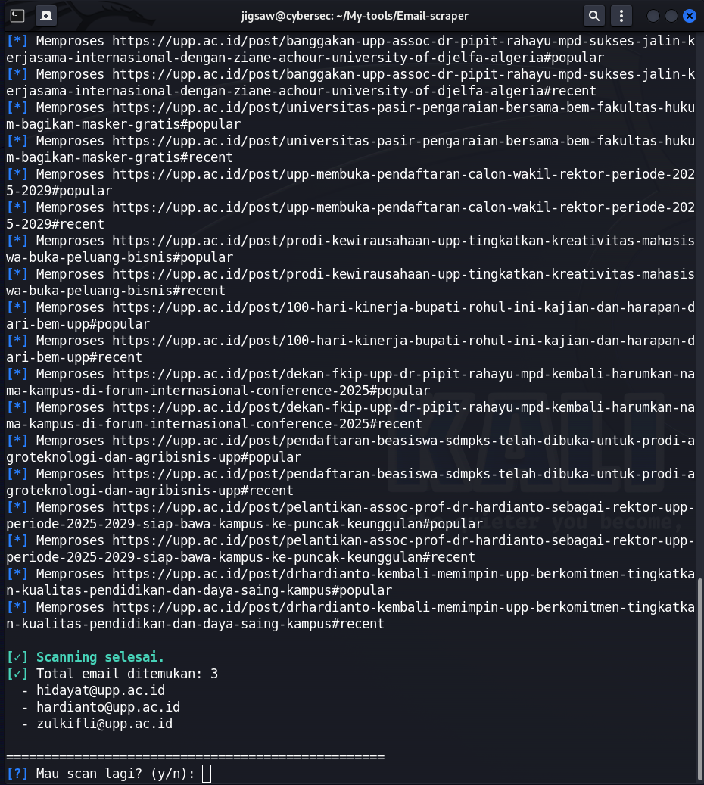

# Email Scraper

[](LICENSE) 
[]

## Deskripsi
**Email Scraper** adalah tool sederhana untuk mengekstrak alamat email dari halaman web atau kumpulan halaman. Cocok untuk keperluan validasi kontak publik, riset, atau memigrasi data kontak yang sudah diperbolehkan secara hukum.

**Penting:** gunakan tool ini secara etis dan sesuai hukum. Jangan gunakan untuk spam, pengumpulan data pribadi tanpa izin, atau aktivitas lain yang melanggar kebijakan situs target / hukum setempat.

## Fitur
- Crawl satu halaman atau daftar URL.
- Ekstraksi alamat email dari HTML (regex + parsing).
- Opsi depth / follow internal links (opsional).
- Filter duplikat dan normalisasi.
- Export hasil ke CSV / TXT / JSON.
- Rate limit dan user-agent configurable.

## Persyaratan
- Python 3.8 atau lebih baru
- Sistem operasi: Linux / macOS / Windows

## Instalasi
1. Clone repo:
```bash
git clone https://github.com/YogaRmdn/Email-scraper.git
cd Email-scraper
python scan.py
```



